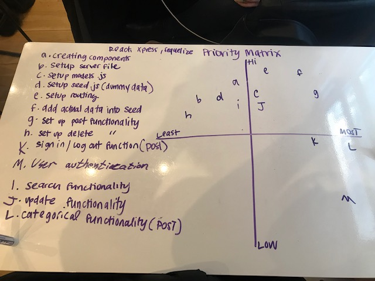

# Project Overview

## Project Schedule

This schedule will be used to keep track of your progress throughout the week and align with our expectations.  

You are **responsible** for scheduling time with your squad to seek approval for each deliverable by the end of the corresponding day, excluding `Saturday` and `Sunday`.

|  Day | Deliverable | Status
|---|---| ---|
|Day 1| Project Description | Complete
|Day 1| Wireframes / Priority Matrix / Architecture / ERD | Complete
|Day 2| Core Application Structure (React, Express and Sequelize Files) | Incomplete
|Day 2| Pseudocode / actual code | Incomplete
|Day 3| Basic Functions Working (Independently) | Incomplete
|Day 3| Initial Clickable Model  | Incomplete 
|Day 3| Partial CRUD on MVP | Incomplete
|Day 4| Full CRUD on MVP | Incomplete
|Day 4| Post MVP | Partially Incomplete
|Day 5| Present | Incomplete

## Project Description

Scribblr:

This is an application that allows writers to submit their works to then be reviewed by others on the site. It is essentially an online writers workshop where writers can receive feedback on work.

ERD:

## Wireframes

Below is the link to Project Wireframes:
https://balsamiq.cloud/s3ujqws/p5d92s5/r56C6
https://balsamiq.cloud/s42mh39/pyr8oww

## Priority Matrix

Include a full list of features that have been prioritized based on the `Time and Importance` Matrix. 

|  Item | Priority | Estimated Time | Actual Time | Total Time
|---|---| ---|---| -- |
| create Components | HI| 1hs | 45min | 45min |
| Setup server file | HI|1hs | 1.5hs | 2.25hs |
| Setup models.js | HI | 2hs | 45min | 3hs |
| Setup seed.js | HI | 30min | 1hs | 3.5hs |
| Setup routing | HI| 2hs | 2hs | 5.5hs |
| Add data to seed.js | HI | 3hs | 30min | 6hs |
| Setup POST functionality |HI| 1hs | 1hs | 7hs |
| Setup DELETE functionality |HI| 1hs | 1hs | 8hs |
| Search (GET) functionality |HI | 2hs | 1hs | 9hs |
| Setup UPDATE functionality |  HI| 1hs | 4hs | 13hs |
| Login/out function (PMVP) |LOW| 3hs | 3hs | 16hs |
| User Authentication (PVMP) | LOW | 6hs | 6hs | 22hs |
| Categorical functionality (PMVP)| LOW| 3hs | 2hs | 24hs |
| TOTAL |  | 25hrs | 24hrs | 24hrs |

### MVP/PostMVP - 5min

The functionality will then be divided into two separate lists: MPV and PostMVP.  Carefully decided what is placed into your MVP as the client will expect this functionality to be implemented upon project completion.  

#### MVP 

- Set up component hierarchy
- set up seed data
- set up server
- set up models
- set routes
- Implement CRUD
- Create search functionality

#### PostMVP 

- Login/out functionality
- User Authentication

## React Architectural Design

Here you will find our architectural design:
[Architectural Design](https://res.cloudinary.com/chucksheppard/image/upload/v1549251147/Project%203%20Component%20Hierarchy/Project%203%20Component%20Hierarchy.jpg)

## Functional Components

Based on the initial logic defined in the previous sections try and breakdown the logic further into stateless/stateful components. 

| Component | Description | 
| --- | :---: |  
| App (Stateful) | Holds the base of our project and routes via react-router |
| Header (Stateless) | Contains navigation for the app. | 
| Footer (Stateless) | Contains social links, copywrite, as well as contact. | 
| PostWork (Stateful) | Where users can post new works to be held in database. |
| ExistingWorks (Stateless) | Works in databse created by users. |
| PostForm (Stateful) | Where users can post new content to share. |
| SignIn (Stateful) | Form for users to create profiles and sign into existing profiles. |

## Helper Functions
Helper functions should be generic enought that they can be reused in other applications. Use this section to document all helper functions that fall into this category.

| Function | Description | 
| --- | :---: |  
| handleChange | Handles actions taken by onClick and add's more functionality to site | 
| handleSubmig | Handles with form submition |

## Dependencies / Technologies
 Use this section to list all dependencies/technologies and thier role in the project. 
 
| Library | What it Does | 
| --- | :---: |  
| React-Select (optional) | (Used to improve functionality and styling of my search/select feature) | 
| React |
| React-Router | Used to improve site navigation |
| Express | Tie front-end to back-end |
| Sequelize | DB communication |
| Nodemon | To facilitate back-end development | 
| Body-Parser | To facilitate putting user-input into the database |
| Morgan | Facilitate debugging with error messages |

## Code Snippet

Use this section to include a brief code snippet of functionality that you are proud of an a brief description  

## Change Log
 Use this section to document what changes were made and the reasoning behind those changes.  

| Original Plan | Outcome | 
| --- | :---: |  
| plan | reality | 
